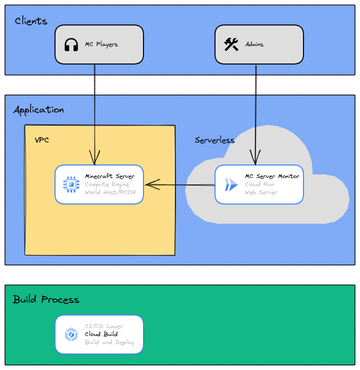

# MC-Server-Monitor

Minecraft Server Monitor is a Golang web server application to monitor one's own Minecraft server (thru RCON). This is targeted towards a small Minecraft server size (<10) to do basic adminstrative tasks.  
A terraform script (for GCP) is provided to host the server on the internet quickly (thanks to [Futurice](https://github.com/futurice/terraform-examples) for help)

## Installation

Use [git](https://git-scm.com/) version control to retrieve the Minecraft Server Monitor repository.

```bash
git pull https://github.com/itzsBananas/mc-server-monitor.git
```

## Usage (Local)

### Quickstart

To get started quickly (w/ [Docker](https://www.docker.com/) installed), use the docker command at the repository root

```bash
docker compose up
```

This command boots up a minecraft server and the web server preemptively serving ports 25565 and 25575 respectively.

### Advanced

If you have a local server already running, you can run the command (w/ [Golang](https://go.dev/ installed) at the repository root

```bash
go run ./cmd/web
```

Alternatively, with Docker

```bash
docker compose up mc-server-monitor
```

Both commands boot up the web server at port 25575.

## Usage (hosted on GCP)

⚠️ Incurs cost

Cost Breakdown

-   Static IP - $1.49 / month
-   Compute Engine (Preemptible VM) - $0.01 / hr
-   Persistent Disk - $0.50 / month
-   VM-VM egress pricing - <=$0.15 per GB
-   Cloud Run - Covered under Free tier for most cases; Refer to the [Cloud Run Pricing Page](https://cloud.google.com/run/pricing) for more details

To get started, start a cloud project on [Google Cloud Platform](https://console.cloud.google.com). Take note of the PROJECT_ID.
Then, create a bucket in the [storage section](https://console.cloud.google.com/storage/browser).
Take note of the BUCKET_ID.

Then, change the block in [locals.tf](deployments/locals.tf) based on the previous names. Choose other attributes based on your preference.

Finally, use the command (w/ [Terraform](https://www.terraform.io/) installed) in the deployments directory

```bash
terraform init
terraform apply
```

If successful, you can view the minecraft [server](https://console.cloud.google.com/compute/instances)



Cloud Architecture of MC-Server-Monitor

## Acknowledgements

Thanks to [itzg](https://github.com/itzg) and [Futurice](https://github.com/futurice) for the docker image and terraform script respectively.

## Contributing

Pull requests are welcome. For major changes, please open an issue first to discuss what you would like to change.

## License

[MIT](https://choosealicense.com/licenses/mit/)
